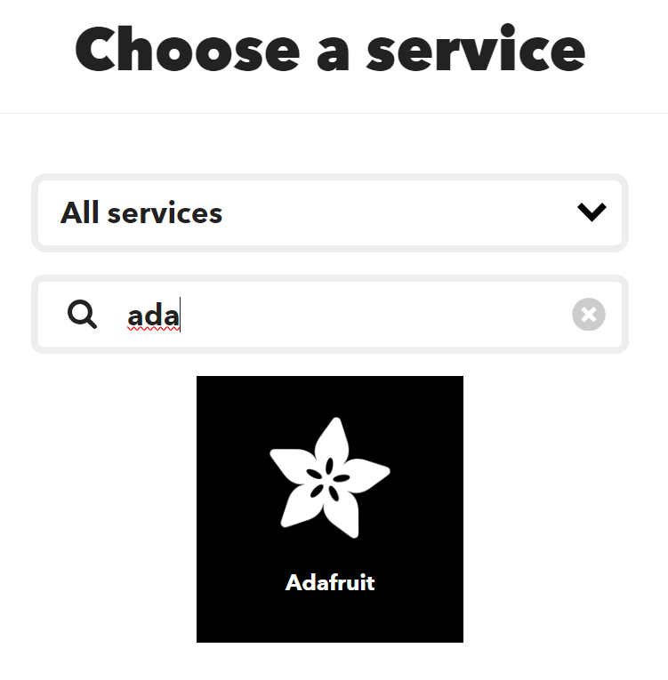

# TempHumidityWatcher (GuardBricks Prototype 0)

In this guide we will provide instructions on how to build and set up the *TempHumidityWatcher*, a temperature and humidity monitor, built with **GuardBricks**. This guide goes through the *hardware*, the *code* and the *websites* you will need to be able to run the prototype.

## General Information

**GuardBricks** can provide information about the state of *secluded locations*, such as basements and attics, using a combination of *microcontrolers* and *sensors*, such as Arduinos and temperature sensors, and also notify the user through email if an anomaly in the data gathered has been detected. Hopefully, it can alert the user to visit the secluded location and mitigate a problem early on, when addressing the problem is less difficult and more effective.

## Built With

Prototype 0 uses the **Arduino MKR Wifi 1010 Board** as a microcontroler to manage the humidity and temperature sensors found in the **Arduino MKR IoT Carrier**.
The source code provided [here](Proto0Code) can be viewed and edited in the **Arduino Integrated Development Environment (IDE)**. The code can then be uploaded to the board, for execution. If all goes well, you will be able to visualize the values of the humidity and temperature for the monitored room on the **Adafruit** dashboard.
In addition, by making use of **IFTTT** you will be able to receive notifications by email if the values gathered are too low or too high.

### Hardware

* [Arduino MKR Wifi 1010 Board](https://store.arduino.cc/products/arduino-mkr-wifi-1010) - 1 unit - microcontroler to gather and process data
* [Arduino MKR IoT Carrier](https://store-usa.arduino.cc/products/arduino-mkr-iot-carrier) - 1 unit - Contains the Humidity and Temperature sensors
* [Micro USB](https://www.amazon.com/micro-usb-cable/s?k=micro+usb+cable) - 1 unit - cable to connect the arduino to the computer for code upload

### Software

* [Arduino IDE](https://www.arduino.cc/en/software) - development environment to change code and upload it to the *Arduino Board*, where it can be executed

### Network

* [WiFi]() - you will need to provide a WiFi connection to the *Arduino Board*

### Websites

* [Adafruit](https://io.adafruit.com) - **Adafruit** cloud serves as a centralized hub for project data. It allows us to store, access and showcase metrics like temperature and humidity on dashboards. 

* [IFTTT](https://ifttt.com) - **IFTTT, or "If This Then That"**, is a web-based automation service. It connects various online platforms to trigger actions based on specific events. Users create **Applets**, defining the conditions (triggers) and resulting actions (that), simplifying repetitive tasks by automating them through if-then logic. 

## Getting Started

The diagram bellow allows you to have a general view of the components and their task in this prototype.  

### Account Creation

To be able to see the changes in humidity and temperature you will need to [create an account](https://accounts.adafruit.com/users/sign_up) on *AdaFruit*.

To be able to receive notifications when an anomaly is detected, you will need to [create an account](https://ifttt.com/join) on *IFTTT*

> [!IMPORTANT]
> Using *AdaFruit* you can also receive notifications without the need of *IFTTT*. Later both options will be explored.

### Instalations

You will also need to download the Arduino IDE to be able to alter the code and upload it to the Arduino

After installing the IDE you will also need the following libraries so that the code can run properly:

- [Arduino_MKRIotCarrier](https://www.arduinolibraries.info/libraries/arduino_mkr-io-t-carrier), **version 2.0.4** by Ricardo Rizzo
- [WiFiNINA](https://www.arduinolibraries.info/libraries/wi-fi-nina), **version 1.8.14** by Arduino
- [Adafruit IO Arduino](https://www.arduinolibraries.info/libraries/adafruit-io-arduino), **version 4.2.9** by Adafruit

To install libraries, in the Arduino IDE, go to the tab **Tools > Manage Libraries** or select the **bookshelf icon** on the left, type in the name of the libraries to look it up and then click install on the one that shows up.

> [!IMPORTANT]
> Use the version of the libraries provided which are the same used in our tests. In addition when installing one of the libraries be sure to install also any other package the Arduino IDE asks to install.

### AdaFruit DashBoard Creation

After creating an account on [Adafruit](https://io.adafruit.com), go to the **IO** tab and choose **Feeds**.
There you will want to create two feeds: one called *Humidity* and another called *Temperature*.

When the two feeds are created go to the *Dashboard* tab and create a new dashboard.

Click on the new dashboard, choose **create a new block** and select **Graph Chart**. Select the two feeds and then Next Step. Finally press **Create Block**.

You should now see something like this.

### Notification setup

To be able to receive notifications, there are two ways to do it. The first one and the one who gives you more options is using the *Adafruit Actions*. This allows you to create as many notification triggers as you want, limit the number of alerts you get an hour and get a notification when the trigger as been disabled. 
For the second one you will need to create an account on *IFTTT* which the free plan only offers a very reduced solution as it only provides two notification triggers and you can not control how many notifications per minute you receive.

#### Using AdaFruit

Go to the tab **Actions** and select **New Action**.

Here you will have three possible options but the one we will explore is the *Reactive* action, which does something only once the date is uploaded to the AdaFruit feed.

After choosing the type of action you want, you create your notification.

As an example, if you want to receive an email for when the temperature is too low you can complete the input form as follows and select **Submit**.

When the notification configuration has been submitted you will be able to see all the actions created.

Since each action only allows you to receive a notification for when the *Feed* is lower or higher than a certain value, we advise you to create multiple actions for a single *Feed*.

In the example below, we use 10 and 40 degrees celsius as the threshold.

#### Using IFTTT

When logged in to your account, click on the **Create** button on top of the screen.

After that you will be brought to a screen where you can read:
> If This

> Then That

Select Add and choose AdaFruit.

> [!NOTE]
> You will need to connect **Adafruit** to **IFTTT** to be able to create the *Applet*

Then choose **Monitor a Feed on Adafruit IO** as shown below.

Complete the following screen with the values you think that are the most accurate for your scenario and then select **Create Trigger**.

In this example we consider 80% as the threshold value for humidity.

Finally, select **Add** on the "Then That" line and choose Gmail.

Select **Send yourself an Email** and then complete the following screen with your email and with the information you want to receive on the mail.

When all steps are done select Continue and then Finnish.

> [!IMPORTANT]
> To receive notifications for both temperature and humidity you will have to create two Applets.

### Upload the Code

First download the code to your desktop.

Before uploading the code you will need to change some things in the code. 

Go to the conf.h file and change the **AdafruitUsername**, **AdaFruitKey** (which you can find on the tab IO on Adafruit.com under the little key symbol), **NetworkName** and **NetworkPass**.

When this is complete, plug the Arduino board to the computer using the *Micro USB cable* and click upload code.

You should start seeing values appear on Adafruit Dashboard.

### Use of external battery

After uploading the code to the Arduino, you can unplug the arduino from the computer and plug it to a powerbank.

If the values on the dashboard are not changing, press the reset button on the Arduino (blue button).

# Conclusion

This document, details TempHumidityWatcher, Prototype 0 of GuardBricks.
The project utilizes Arduino MKR Wifi 1010 Board to manage sensors, monitoring humidity and temperature via Adafruit dashboard. It incorporates IFTTT for email notifications. The guide covers hardware, software, and web applications setup. Users need Adafruit accounts for data display and IFTTT for notifications. Additionally, instructions for code upload and usage with an external battery are provided for working solution to monitor secluded locations.