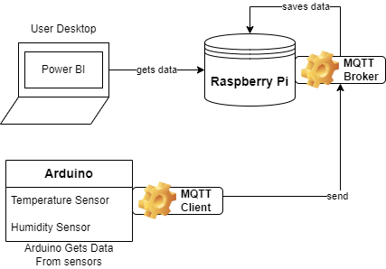
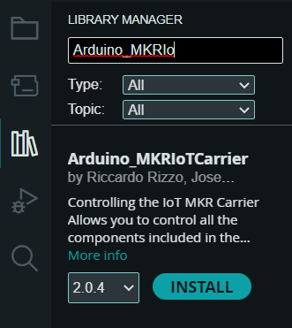
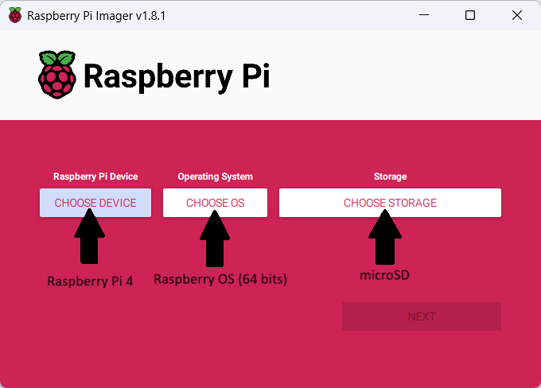
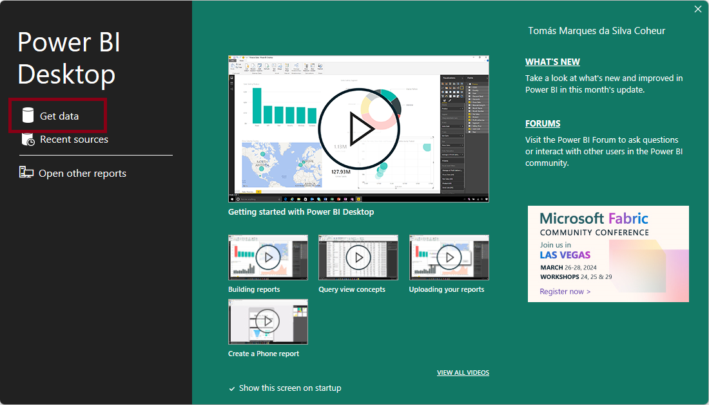
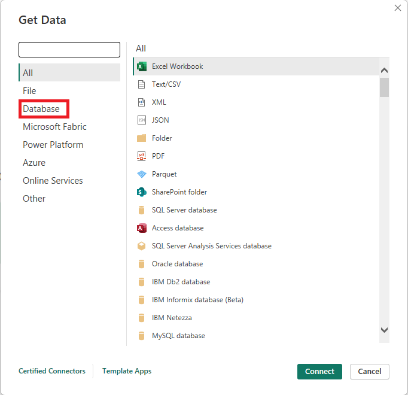
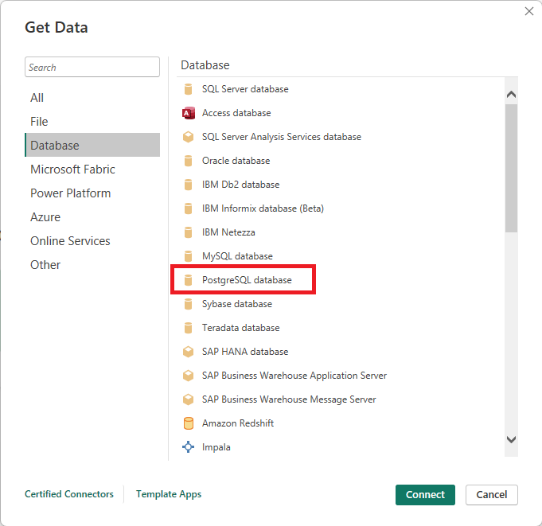
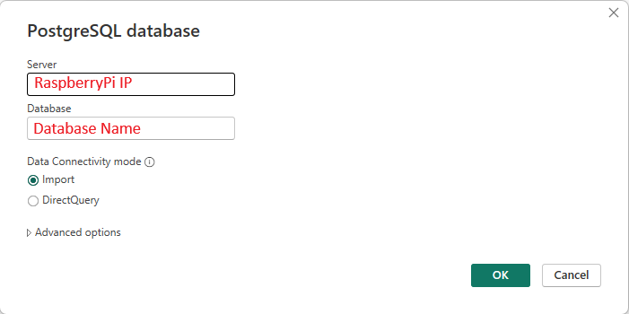
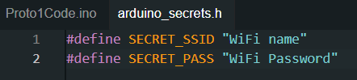
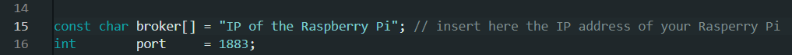

# LocalServePi (GuardBricks Prototype 1)

In this guide we will provide instructions on how to build and set up the *LocalServePi*, a temperature and humidity monitor, built with **GuardBricks**. This guide goes through the *hardware*, the *code* and the *websites* you will need to be able to run the prototype.

## General Information

**GuardBricks** can provide information about the state of *secluded locations*, such as basements and attics, using a combination of *microcontrolers* and *sensors*, such as Arduinos and temperature sensors, and also notify the user through email if an anomaly in the data gathered has been detected. Hopefully, it can alert the user to visit the secluded location and mitigate a problem early on, when addressing the problem is less difficult and more effective.

## Built With

Prototype 1 uses the **Arduino MKR Wifi 1010 Board** as a microcontroler to manage the humidity and temperature sensors found in the **Arduino MKR IoT Carrier**.
The source code provided [here](Proto1Code) can be viewed and edited in the **Arduino Integrated Development Environment (IDE)**. The code can then be uploaded to the board, for execution.

For this prototype, a **Raspberry Pi 4** is also used as hub that will receive the data from the **Arduino** via **WiFi** using a protocol named **MQTT**. To be able to run the server on the **Raspberry Pi** you will need to have a **microSD** with the content provided [here]()

### Hardware

* [Arduino MKR Wifi 1010 Board](https://store.arduino.cc/products/arduino-mkr-wifi-1010) - 1 unit - microcontroler to gather and process data
* [Arduino MKR IoT Carrier](https://store-usa.arduino.cc/products/arduino-mkr-iot-carrier) - 1 unit - Contains the Humidity and Temperature sensors
* [Micro USB](https://www.amazon.com/micro-usb-cable/s?k=micro+usb+cable) - 1 unit - cable to connect the arduino to the computer for code upload
* [Monitor with HDMI port]() - 1 unit -
* [HDMI or Micro HDMI]() - 1 unit - cable to connect the raspberry pi to to a monitor
* [Raspberry Pi 4](https://www.raspberrypi.com/products/) to serve as a local web server to display data and send notifications

### Software

* [Arduino IDE](https://www.arduino.cc/en/software) - development environment to change code and upload it to the *Arduino Board*, where it can be executed
* [Power BI](https://www.microsoft.com/en-us/power-platform/products/power-bi) - Power BI is a collection of software services, apps, and connectors that work together to turn your unrelated sources of data into coherent, visually immersive, and interactive insights

### Network

* [WiFi]() - you will need to provide a WiFi connection to the *Arduino Board* 

## Getting Started

The diagram bellow allows you to have a general view of the components and their task in this prototype.  

 

## Instalations

To be able to visualize the data gathered by the *Arduino* we will make use of *Power Bi Desktop*, a tool created by **Microsoft** that allows you to display information in a more understandable way through graphics and other visual charts.

You can download *Power Bi* [here](https://www.microsoft.com/en-us/power-platform/products/power-bi). Keep in mind that you will have to buy a license or use your work email to be able to use the software.

You will also need to download the Arduino IDE to be able to alter the code and upload it to the Arduino

After installing the IDE you will also need the following libraries so that the code can run properly:

- [Arduino_MKRIotCarrier](https://www.arduinolibraries.info/libraries/arduino_mkr-io-t-carrier), **version 2.0.4** by Ricardo Rizzo
- [WiFiNINA](https://www.arduinolibraries.info/libraries/wi-fi-nina), **version 1.8.14** by Arduino
- [ArduinoMQTTClient](https://www.arduino.cc/reference/en/libraries/mqtt-client/), **version 0.1.7** by Arduino

To install libraries, in the Arduino IDE, go to the tab **Tools > Manage Libraries** or select the **bookshelf icon** on the left, type in the name of the libraries to look it up and then click install on the one that shows up.

> [!IMPORTANT]
> Use the version of the libraries provided which are the same used in our tests. In addition when installing one of the libraries be sure to install also any other package the Arduino IDE asks to install.

## Configure Raspberry Pi

### From the beginning

Configuring a Raspberry Pi involves several steps, including setting up the operating system, connecting peripherals, and configuring various settings. Here's a general guide to help you get started:

1. Download and Install the Operating System:
    - Download and install the [Raspberry Pi Imager](https://www.raspberrypi.com/software/) tool to write the OS image to the microSD card.
    - Insert the microSD in you computer.
    - Open the Raspberry Pi Imager application you just installed and select the Raspberry Pi **device** you will use, the **OS image** you want to install in said *Raspberry Pi* and the *microSD* as the **storage device**.

        

2. Connect Peripherals:
    - Insert the microSD card into the Raspberry Pi.
    - Connect a display using an HDMI cable.
    - Connect the keyboard and mouse.
    - Connect to the internet using Ethernet or set up Wi-Fi.
3. Power Up the Raspberry Pi:
    - Plug in the power supply to turn on the Raspberry Pi.
4. Initial Configuration:
    - The first time you boot up, the Raspberry Pi Configuration Wizard will appear.
You can set your localization options, change the password, and expand the file system.
5. Update and Upgrade:
    - Open the terminal and run the following commands to update the package lists and upgrade installed packages:

> sudo apt update

> sudo apt upgrade

### Without peripherals
    
To connect your Raspberry Pi to a VNC server and use PuTTY for SSH access, follow these steps:

1. **Enable SSH on Raspberry Pi:**
    - Make sure your Raspberry Pi is connected to the network.
    - On your Raspberry Pi, open the terminal.
    - Type the following command and press Enter:
        >sudo raspi-config
    - In the Raspberry Pi Configuration menu, navigate to "Interfacing Options" and select "SSH." Enable the SSH server.

2. **Find Raspberry Pi IP Address:**
    - In the terminal on your Raspberry Pi, type the following command to find its IP address:
        > hostname -I
    - Note the IP address for later use.

3. **Install and Configure VNC Server on Raspberry Pi:**
    - You can install VNC Server on your Raspberry Pi using the following commands:
        > sudo apt update

        > sudo apt install realvnc-vnc-server
    - After installation, run the following command to set up and configure the VNC server:
        > vncserver
    - Follow the on-screen instructions to set up a password for VNC access.

4. **Install and Configure PuTTY:**
    - Download PuTTY from the official website: PuTTY Download Page.
    - Install PuTTY on your computer.

5. **Connect to Raspberry Pi with PuTTY:**
    - Open PuTTY and enter the IP address of your Raspberry Pi in the "Host Name (or IP address)" field.
    - Make sure the "Port" is set to 22 (default for SSH).
    - Select the "SSH" connection type.
    - Click "Open" to initiate the connection.
    - Enter your Raspberry Pi's username and password when prompted.

6. **Connect to Raspberry Pi with VNC Viewer:**
    - Download VNC Viewer from the official website: VNC Viewer Download Page.
    - Install VNC Viewer on your computer.
    - Open VNC Viewer and enter the IP address of your Raspberry Pi in the address bar.
    - Enter the VNC password you set up earlier.
    - Click "Connect" to establish the VNC connection.

Now, you should have both SSH access via PuTTY and VNC access to your Raspberry Pi. Use PuTTY for command-line access and VNC Viewer for graphical desktop access.

### Already configured

If you want to skip the configurations steps to setup the *Raspberry Pi* you can follow the instructions below.

You must first clone the IMG file found [here]() (no IMG file available yet) to a **Micro SD** with at least 32GB of space.
When the clone is complete, insert the SD card into the *Raspberry Pi* and connect the *Raspberry Pi* to a **monitor**, a **keyboard** and a **mouse**. This will allow you to use the *Raspberry Pi* as a computer and display its desktop to the monitor.

The **Username** and **Password** to enter the *Raspberry Pi* should be **pi** and **raspberry**.

Connect the Raspberry Pi to your local WiFi.

> [!IMPORTANT]
> Make sure you take note of the Raspberry Pi's IP address because you will need it later.

## Run MQTT on Rasperry Pi

When inside, create two text files one called **humidity.txt** and one called **temperature.txt**. These files will be the temporary storage for the data the *Arduino* will send.

After that open two **consoles** and write the following line in the first console:

> mosquitto_sub -d -t temperature | tee temperature.txt

And the following line in the second console

> mosquitto_sub -d -t humidity | tee humidity.txt 

## Power BI DashBoard Creation

To download and utilize PowerBI, a license is a prerequisite. 
Acquiring this license can be accomplished by either making a purchase or utilizing your enterprise email, which may grant you access to the necessary license.

Launch Power BI and select Get Data. Choose Web and write the following line

> http://ip-raspberrypi

Where ip-raspberrypi must changed to be the IP of the Raspberry Pi.

## Connecting to a SQL Database with Power BI

Power BI is a powerful tool for data analysis and visualization. Connecting it to a SQL database allows you to import data directly into Power BI for further analysis. Here's a step-by-step guide on how to do it:

### Prerequisites

Before you begin, make sure you have the following:

- Installed Power BI Desktop on your computer.
- Access to the SQL database you want to connect to.
- Necessary permissions to access the database.

### Steps

1. **Open Power BI Desktop**: Launch the Power BI Desktop application on your computer.

2. **Get Data**: Click on the "Get Data" button located on the Home tab of the ribbon.
    

3. **Select Database Source**: In the "Get Data" window, select "Database" from the list of available data sources.
    

4. **Choose SQL Server**: Choose "SQL Server" from the list of database options.
    

5. **Connection Settings**: In the "SQL Server database" window, enter the server name or IP address of the SQL server you want to connect to. You can also specify the database name if you want to connect to a specific database on the server.
    

6. **Authentication**: Choose the authentication method to connect to the SQL server. You can select either "Windows" authentication or "Database" authentication (username and password). Enter the necessary credentials accordingly.

7. **Connect**: Click on the "Connect" button to establish the connection to the SQL database.

8. **Select Data**: Once connected, Power BI will display a list of tables/views available in the selected database. Select the tables/views you want to import into Power BI by checking the respective boxes next to them.

9. **Transform Data (Optional)**: You can perform data transformations or apply filters to the selected data before importing it into Power BI. Click on the "Transform Data" button to open the Power Query Editor and apply necessary transformations.

10. **Load Data**: After selecting and transforming the data as needed, click on the "Load" button to import the data into Power BI. Alternatively, you can choose to "Load To" to specify how you want to load the data (e.g., into the data model only, or into a report directly).

11. **Data Refresh (Optional)**: If your SQL database gets updated regularly, you can set up automatic data refresh in Power BI to keep your reports up to date. Configure data refresh settings by clicking on "Transform Data" > "Data source settings" > "Scheduled refresh".

12. **Create Visualizations**: Once the data is loaded into Power BI, you can start creating visualizations, dashboards, and reports based on the imported data.

13. **Save and Publish**: After creating your reports, save the Power BI file (.pbix) and publish it t

## Upload the Code

First download the [code](Proto1Code) to your desktop.

Before uploading the code you will need to change some things in the code. 

Go to the *arduino_secrets.h* file and change the **WiFi Name**, **Wifi Password**.

You will also need to provide the *Arduino* with the Raspberry's IP address. For that you just need to go to the *Proto1Code.ino* file and change line 15 to insert the Raspberry's IP address.

When this is complete, plug the Arduino board to the computer using the *Micro USB cable* and click upload code.

# Conclusion

This document, details LocalServerPi, Prototype 1 of *GuardBricks*.
The project utilizes Arduino MKR Wifi 1010 Board to manage sensors, monitoring humidity and temperature via *Power BI* dashboard.