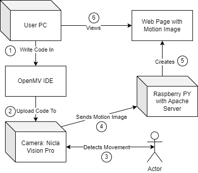
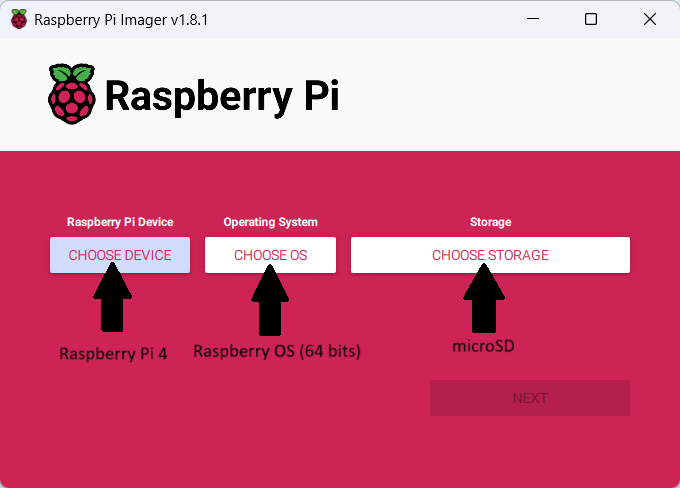
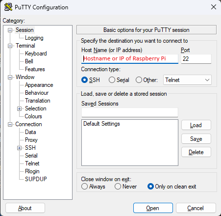
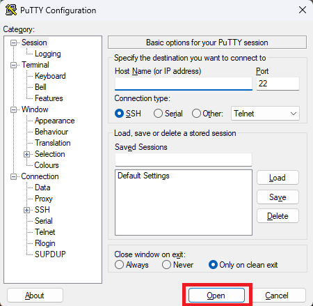
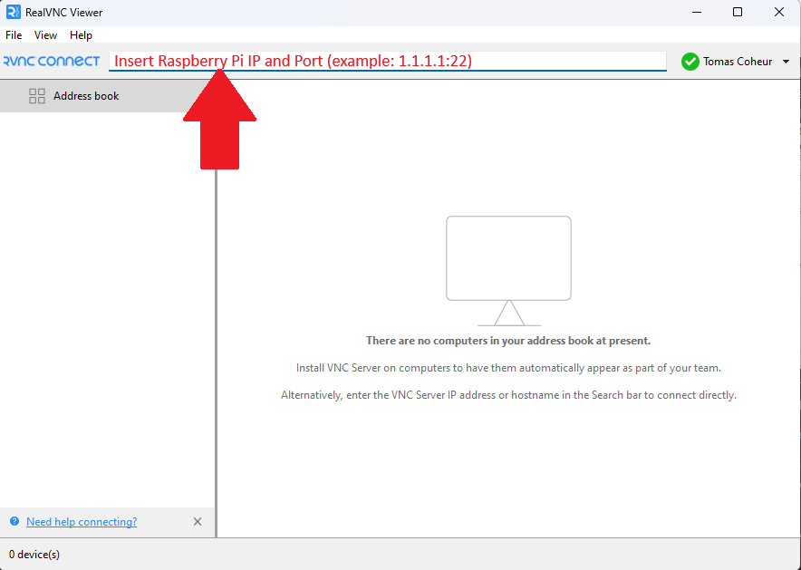
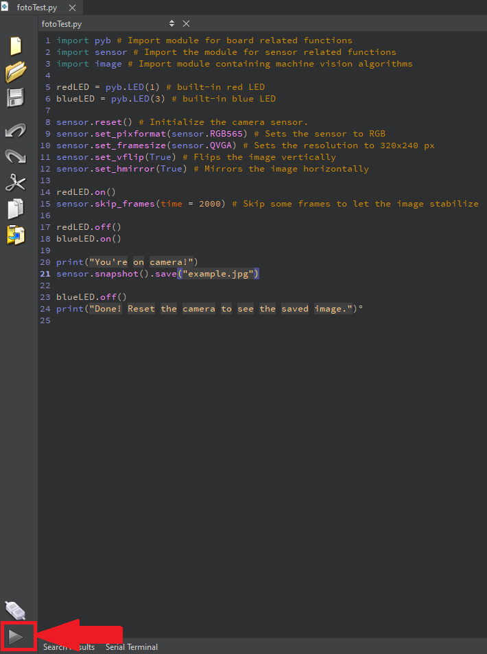
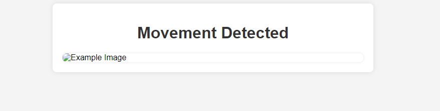

# Vigilante 1.0 (GuardBricks Prototype 2)

In this guide we will provide instructions on how to build and set up the *Vigilante 1.0*, a movement detector, built with **GuardBricks**. This guide goes through the *hardware*, the *code* and the *websites* you will need to be able to run the prototype.

## General Information

**GuardBricks** can provide information about the state of *secluded locations*, such as basements and attics, using a combination of *microcontrolers* and *sensors*, such as Arduinos and temperature sensors, and also notify the user through email if an anomaly in the data gathered has been detected. Hopefully, it can alert the user to visit the secluded location and mitigate a problem early on, when addressing the problem is less difficult and more effective.

## Built With

Prototype 2 uses the **[Nicla Vision Pro](https://store.arduino.cc/products/nicla-vision)** as a microcontroler and camera to detect movements in the secluded location.
The source code provided [here](Proto2Code/niclavision.py) can be viewed and edited in the **[OpenMV](https://openmv.io/) IDE**. The code can then be uploaded to the board, for execution.

For this prototype, a **[Raspberry Pi 4](https://www.raspberrypi.com/products/)** is also used as hub that will receive the images from the **[Nicla Vision Pro](https://store.arduino.cc/products/nicla-vision)** via **WiFi**. To be able to run the server on the **[Raspberry Pi 4](https://www.raspberrypi.com/products/)** you will need to have a **microSD** with the content provided [here]()

### Hardware

- [Nicla Vision Pro](https://store.arduino.cc/products/nicla-vision)
- [Raspberry Pi 4](https://www.raspberrypi.com/products/)
- [Micro USB](https://www.amazon.com/micro-usb-cable/s?k=micro+usb+cable) - 1 unit - cable to connect the arduino to the computer for code upload
- [Monitor with HDMI port]() - 1 unit -
- [HDMI or Micro HDMI]() - 1 unit - cable to connect the raspberry pi to to a monitor

### Software

* [OpenMV](https://openmv.io/) - IDE to write and alter the code for the [Nicla Vision](https://store.arduino.cc/products/nicla-vision) Board
* [RealVNC](https://www.realvnc.com/en/connect/download/vnc/) - software to be able to see the Raspberry's desktop on your local computer
* [Putty](https://www.putty.org/) - to be able to connect to raspberry pi via **ssh** from your PC

### Network

* [WiFi]() - you will need to provide a WiFi connection to the *Arduino Board* 

## Getting Started

The system operates as follows: A Python script is authored and uploaded onto the [Nicla Vision Pro](https://store.arduino.cc/products/nicla-vision) Board. This script is designed to enable the attached camera to detect motion and subsequently capture an image of the detected movement. Once captured, the image is sent to an Apache server hosted on a [Raspberry Pi 4](https://www.raspberrypi.com/products/). Users can conveniently access the image by simply navigating to a provided web link, granting them immediate viewing access.

## Configure [Raspberry Pi 4](https://www.raspberrypi.com/products/)

To start, let's outline the steps to configure the [Raspberry Pi 4](https://www.raspberrypi.com/products/) and install an operating system onto the board.

### From the beginning

Configuring a [Raspberry Pi 4](https://www.raspberrypi.com/products/) involves several steps, including setting up the operating system, connecting peripherals, and configuring various settings. Here's a general guide to help you get started:

1. Download and Install the Operating System:
    - Download and install the [Raspberry Pi Imager](https://www.raspberrypi.com/software/) tool to write the OS image to the microSD card.
    - Insert the microSD in you computer.
    - Open the Raspberry Pi Imager application you just installed and select the [Raspberry Pi 4](https://www.raspberrypi.com/products/) **device** you will use, the **OS image** you want to install in said *[Raspberry Pi 4](https://www.raspberrypi.com/products/)* and the *microSD* as the **storage device**.

        

2. Connect Peripherals:
    - Insert the microSD card into the [Raspberry Pi 4](https://www.raspberrypi.com/products/).
    - Connect a display using an HDMI cable.
    - Connect the keyboard and mouse.
    - Connect to the internet using Ethernet or set up Wi-Fi.
3. Power Up the [Raspberry Pi 4](https://www.raspberrypi.com/products/):
    - Plug in the power supply to turn on the [Raspberry Pi 4](https://www.raspberrypi.com/products/).
4. Initial Configuration:
    - The first time you boot up, the [Raspberry Pi 4](https://www.raspberrypi.com/products/) Configuration Wizard will appear.
You can set your localization options, change the password, and expand the file system.
5. Update and Upgrade:
    - Open the terminal and run the following commands to update the package lists and upgrade installed packages:

> sudo apt update

> sudo apt upgrade

### Without peripherals
    
To connect your [Raspberry Pi 4](https://www.raspberrypi.com/products/) to a [RealVNC](https://www.realvnc.com/en/connect/download/vnc/) server and use PuTTY for SSH access, follow these steps:

1. **Enable SSH on [Raspberry Pi 4](https://www.raspberrypi.com/products/):**
    - Make sure your [Raspberry Pi 4](https://www.raspberrypi.com/products/) is connected to the network.
    - On your [Raspberry Pi 4](https://www.raspberrypi.com/products/), open the terminal.
    - Type the following command and press Enter:
        >sudo raspi-config
    - In the [Raspberry Pi 4](https://www.raspberrypi.com/products/) Configuration menu, navigate to "Interfacing Options" and select "SSH." Enable the SSH server.

2. **Install and Configure [Putty](https://www.putty.org/):**
    - Download [Putty](https://www.putty.org/) from the official website: PuTTY Download Page.
    - Install [Putty](https://www.putty.org/) on your computer.

3. **Connect to [Raspberry Pi 4](https://www.raspberrypi.com/products/) with [Putty](https://www.putty.org/):**
    - Open [Putty](https://www.putty.org/) and enter the IP address of your [Raspberry Pi 4](https://www.raspberrypi.com/products/) in the "Host Name (or IP address)" field.
    
    - Make sure the "Port" is set to 22 (default for SSH).
    - Select the "SSH" connection type.
    - Click "Open" to initiate the connection.
    
    - Enter your [Raspberry Pi 4](https://www.raspberrypi.com/products/)'s username and password when prompted.

4. **Find [Raspberry Pi 4](https://www.raspberrypi.com/products/) IP Address:**
    - In the terminal on your [Raspberry Pi 4](https://www.raspberrypi.com/products/), type the following command to find its IP address:
        > hostname -I
    - Note the IP address for later use.

5. **Connect to [Raspberry Pi 4](https://www.raspberrypi.com/products/) with [RealVNC](https://www.realvnc.com/en/connect/download/vnc/) Viewer:**
    - Download [RealVNC](https://www.realvnc.com/en/connect/download/vnc/) Viewer from the official website: VNC Viewer Download Page.
    - Install [RealVNC](https://www.realvnc.com/en/connect/download/vnc/) Viewer on your computer.
    - Open [RealVNC](https://www.realvnc.com/en/connect/download/vnc/) Viewer and enter the IP address of your [Raspberry Pi 4](https://www.raspberrypi.com/products/) in the address bar.
    
    - Enter the VNC password you set up earlier.
    - Click "Connect" to establish the VNC connection.

Now, you should have both SSH access via [Putty](https://www.putty.org/) and [RealVNC](https://www.realvnc.com/en/connect/download/vnc/) access to your Raspberry Pi. Use [Putty](https://www.putty.org/) for command-line access and [RealVNC](https://www.realvnc.com/en/connect/download/vnc/) Viewer for graphical desktop access.

## Create [Raspberry Pi 4](https://www.raspberrypi.com/products/) Web server

To set up an Apache web server on a [Raspberry Pi 4](https://www.raspberrypi.com/products/), you can follow these steps:

### 1. Update your [Raspberry Pi 4](https://www.raspberrypi.com/products/):
Make sure your [Raspberry Pi 4](https://www.raspberrypi.com/products/) is up to date by running the following commands:
>sudo apt update

>sudo apt upgrade

### 2. Install **Apache**:
Install the Apache web server by running the following command:

>sudo apt install apache2

### 3. Start **Apache**:

After the installation is complete, Apache should start automatically. However, if it doesn't, you can start it manually using:

>sudo systemctl start apache2

### 4. Verify **Apache** is Running:
Open a web browser on another device and enter the IP address of your [Raspberry Pi 4](https://www.raspberrypi.com/products/). You should see the default Apache web page indicating that **Apache** is installed and running.

### 5. Accessing Your Web Server:
You can place your website [files](Proto2Code/imageServer.html) in the /var/www/html/ directory. Anything placed in this directory will be accessible via your web browser using the IP address of your [Raspberry Pi 4](https://www.raspberrypi.com/products/).

## Configure [Nicla Vision Pro](https://store.arduino.cc/products/nicla-vision) with [OpenMV](https://openmv.io/)

[OpenMV](https://openmv.io/) is an open-source microcontroller-based platform designed for machine vision applications. It enables you to easily integrate machine vision capabilities into your projects. Here's a step-by-step guide on how to download [OpenMV](https://openmv.io/) and connect a board to it:

### 1. Download [OpenMV](https://openmv.io/) IDE

- Visit the [OpenMV](https://openmv.io/) website at [openmv.io](https://openmv.io/).
- Navigate to the "Software" section.
- Download the [OpenMV](https://openmv.io/) IDE appropriate for your operating system (Windows, macOS, or Linux).

### 2. Install [OpenMV](https://openmv.io/) IDE

- Once the download is complete, install the [OpenMV](https://openmv.io/) IDE by following the installation instructions specific to your operating system.

### 3. Open [OpenMV](https://openmv.io/) IDE

- Launch the [OpenMV](https://openmv.io/) IDE application on your computer.

### 4. Connect [Nicla Vision Pro](https://store.arduino.cc/products/nicla-vision) Board

- Connect your [Nicla Vision Pro](https://store.arduino.cc/products/nicla-vision) board to your computer using a USB cable.
- Ensure that the board is properly powered on.

### 5. Upload the code

- Add this [code](Proto2Code\niclavision.py) to the [OpenMV](https://openmv.io/) IDE and select the **play arrow** at the bottom of the screen.

## See Images collected

- Open a new browser in your computer
- On the search bar insert http://raspberrypi-IP/movement
- You should see the following:

- If you move in front of the [Nicla Vision Pro](https://store.arduino.cc/products/nicla-vision) you should see an image appear where it says **Example Image**

## Conclusion

Congratulations! You have successfully set up your [Nicla Vision Pro](https://store.arduino.cc/products/nicla-vision) camera to connect to a [Raspberry Pi 4](https://www.raspberrypi.com/products/) via Wi-Fi and send an image when it detects motion. You can further customize and extend this setup based on your specific requirements and preferences.
